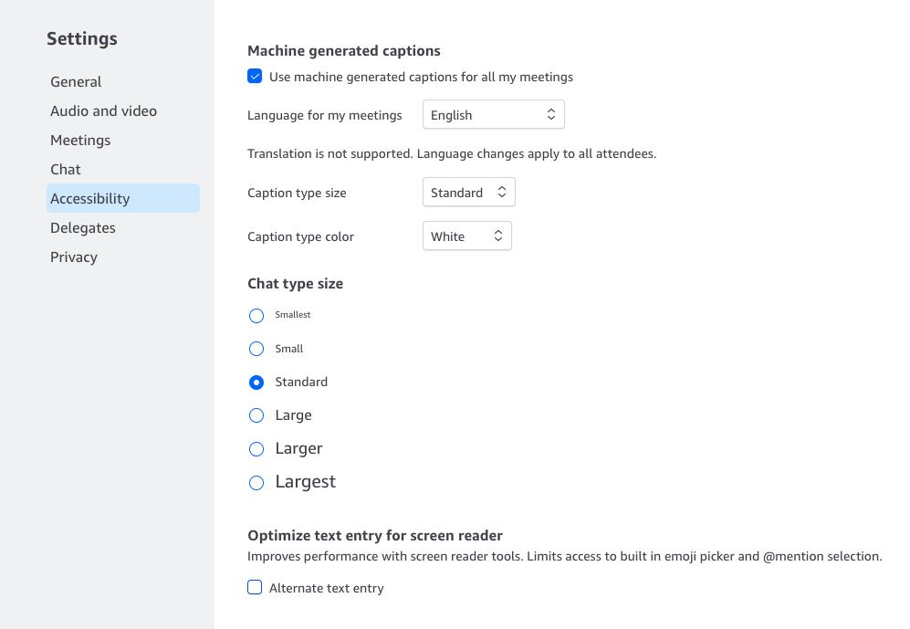

# Chime Chief Mate - Enhance Your Amazon Chime Meetings

Chime Chief Mate is a Tampermonkey UserScript designed to elevate your browser based Amazon Chime meeting experience. It enables users to enhance their meetings by saving Chime chat conversations and machine-generated captions directly to their disk. Additionally, the script provides the functionality to generate meeting summarizations and action items based on your job function.

## Features

- Save Chime chat conversations and machine-generated captions to your local disk.
- Generate meeting summarizations and action items tailored to your specific job function. (online mode only)
- Supports multiple roles: Account Manager (AM), Solutions Architect (SA), District Manager (DM), and Technical Account Manager (TAM)  (online mode only).

## How to Use

Follow these simple steps to set up and use Chime Chief Mate:

1. **Install Tampermonkey Extension**:
   Ensure you have the Tampermonkey extension installed in your browser. If you are using Chrome, you can get it from the [Chrome Web Store](https://chrome.google.com/webstore/detail/tampermonkey/dhdgffkkebhmkfjojejmpbldmpobfkfo?hl=en). For other browsers, please download the appropriate version of Tampermonkey.

2. **Install Chime Chief Mate UserScript**:
   Navigate to the installation URL: [ChimeMeetingCC.user.js](https://github.com/wchemz/ChimeChiefMate/raw/main/scripts/ChimeMeetingCC.user.js). Tampermonkey will detect the script and prompt you to install it. Confirm the installation.

3. **Configure Your Role**:
   Open the installed Chime Chief Mate UserScript. Locate the line of code that defines your role and update it as follows:
```
   const roleName = RoleEnum.NA; // Change "NA" to your role (AM, SA, DM, TAM, HR and SUPPORT)
```

Chime Chief Mate currently supports four roles: AM, SA, DM, TAM, HR and SUPPORT. Stay tuned for additional roles in future releases.

4. **Start Enhancing Your Meetings**:
   - Join an Amazon Chime meeting that is generating machine-generated captions.
   - Enable "Machine generated captions" from Chime Setting page
   
   - During the meeting, click the newly added "Save Chat & Captions" &#x1F4BE; button on the Amazon Chime interface.
   - The UserScript will generate a text file containing the captions and prompt you to save it to your local disk.

## Get Meeting Summaries and Action Items

If you wish to have Chime Chief Mate summarize your meeting notes and generate action items for you, or if you have any inquiries, please contact the project maintainer: [wchemz@amazon.com](mailto:wchemz@amazon.com).

## Contributing

Chime Chief Mate is an open-source project, and contributions are welcome. If you have ideas for improvements or encounter any issues, feel free to create a GitHub issue or submit a pull request.

## License
This project is licensed under the [MIT License](LICENSE).
